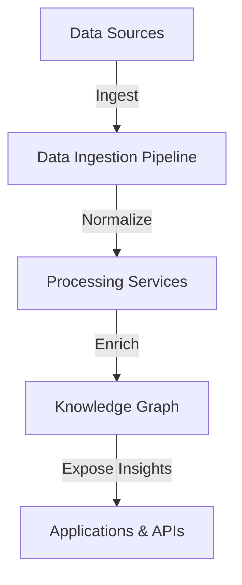

# Mycelia AI Architecture Overview

## Component Responsibilities
- **Data Sources**: External datasets, APIs, or message streams that feed the platform.
- **Data Ingestion Pipeline**: Manages connectors, scheduling, and normalization tasks.
- **Processing Services**: Apply enrichment, validation, and feature extraction logic.
- **Knowledge Graph**: Centralized, queryable store for relationships and entities.
- **Applications & APIs**: Deliver insights to end users and downstream systems.
